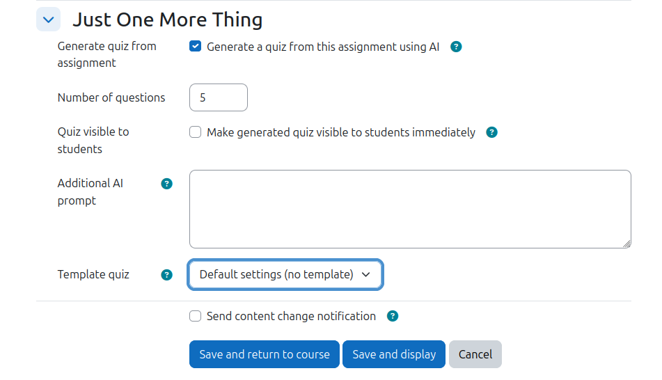

# Just One More Thing — User Guide

**Just One More Thing** (`local_jomot`) automatically builds a personalised quiz for each
student when they submit an assignment. The generated quiz uses the **AIText** question type,
which marks and gives feedback on free-text responses.

Each quiz:

- Reflects the individual student's own submission, not a generic template
- Appears automatically after the next cron run — no manual step needed
- Is named `firstname-lastname_assignmentname` after the student who submitted
- Can only be seen and taken by the student it is named after (hidden from everyone else)

## Requirements

- Moodle 5.0 or later
- The **AIText** question type (`qtype_aitext`) installed
- The AI bridge tool (`tool_ai_bridge`) and a connection to an external LLM enabled on your site
- The plugin installed by an admin (**Site administration → Notifications**)

## Enabling it on an assignment

1. Open any assignment and choose **Edit settings**.
2. Scroll to the **Just One More Thing** section near the bottom of the form.
3. Tick **Generate quiz from assignment**.
4. Save the form.

The help icon next to the checkbox explains: *"When enabled, Just One More Thing will
automatically generate a quiz based on this assignment's content after submission."*

## What happens next

When a student submits the assignment, the plugin queues a background task. On the next cron
run that task sends the student's submission to the AI, generates the questions, and creates
the quiz in the course — named after the student, and restricted so only that student can
access it.

## What kind of submissions are handled

The plugin reads two kinds of submission content and combines them into the text sent to the AI:

- **Online text** — the content a student types into the in-browser text editor. HTML formatting
  is stripped, so the AI receives plain text (headings, bold, lists, links and similar markup are
  removed; the words remain).
- **Attached files that can be converted to text** — plain-text files (`.txt`) are read directly;
  word-processor documents (such as DOCX or ODT) are converted to text using your site's document
  converter. The converted text is then included alongside the online text.

When both online text and files are present, the content is labelled (`[Online text submission]`
and `[Submitted files]`) so the AI can tell the sources apart. Extracted file text is cached, so a
student resubmitting the **same** file is not re-converted.

The following are **not** read and have no effect on the generated questions:

- **PDF files** — not supported in this version.
- **Images, audio and video** — whether attached as files or embedded in the online text.
- **Any file type your site's document converter cannot turn into text** — these are skipped and
  noted in the cron log. The names of skipped files are also included as a short note in the text
  sent to the AI, so the generated questions reflect that some submitted content was not analysed.

Notes:

- Document conversion depends on a working site **document converter** (for example unoconv or a
  Google Drive converter) being configured by an admin. Without one, only `.txt` files and online
  text are used.
- If a submission has **no** usable text at all (no online text and no convertible files), the quiz
  is still created but contains **no AI-generated questions**.

## Options

When editing the assignment you can also control:

- **Number of questions** — how many questions the generated quiz contains (default 5,
  maximum 50). Questions are shown one per page.
- **Quiz visible to students** — make the quiz visible immediately, or leave it hidden
  (the default) so you can review it before releasing.
- **Additional AI prompt** — extra text appended to the default prompt, to steer how the AI
  generates questions and feedback for this assignment.
- **Template quiz** — pick an existing quiz in the course whose settings (time limit, attempts,
  grade method, review options, etc.) are copied into each generated quiz. Per-student naming,
  visibility and access are still controlled by the plugin. Choose *Default settings (no
  template)* to use the plugin defaults.

## Admin settings

Under **Site administration → Plugins → Local plugins → Just One More Thing**:

- **Default AI prompt** — the base prompt sent to the AI when generating questions. The
  `{numquestions}` placeholder is replaced with the configured number of questions.
- **Template tag** — when set, only quizzes whose activity carries that tag appear in the
  **Template quiz** selector. Leave empty to list every quiz in the course.

## License

GNU GPL v3 or later — see <http://www.gnu.org/copyleft/gpl.html>

## Author

Marcus Green, 2026
