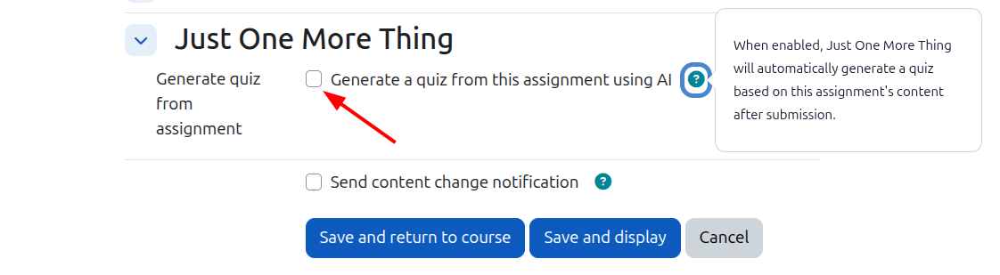

# Just One More Thing — User Guide

**Just One More Thing** (`local_jomot`) automatically builds a personalised quiz for each
student when they submit an assignment. The generated quiz uses the **AIText** question type,
which marks and gives feedback on free-text responses.

Each quiz:

- Reflects the individual student's own submission, not a generic template
- Appears automatically after the next cron run — no manual step needed
- Is named after the student who submitted
- Can only be taken by the student it is named after

## Requirements

- Moodle 5.0 or later
- The **AIText** question type installed
- A connection to an external LLM enabled in your site
- The plugin installed by an admin (**Site administration → Notifications**)

## Enabling it on an assignment

1. Open any assignment and choose **Edit settings**.
2. Scroll to the **Just One More Thing** section near the bottom of the form.
3. Tick **Generate quiz from assignment**.
4. Save the form.

The help icon next to the checkbox explains: *"When enabled, Just One More Thing will
automatically generate a quiz based on this assignment's content after submission."*

## What happens next

Once a student submits the assignment, a scheduled task builds their quiz on the next cron run.
The quiz then appears in the course, named after the student, and only that student can take it.

## Options

When editing the assignment you can also control:

- **Number of questions** — how many questions the generated quiz contains (default 1 per page).
- **Quiz visible to students** — make the quiz visible immediately, or leave it hidden so you can
  review it before releasing.
- **Additional AI prompt** — extra text appended to the default prompt, to steer how the AI
  generates feedback for this assignment.

## License

GNU GPL v3 or later — see <http://www.gnu.org/copyleft/gpl.html>

## Author

Marcus Green, 2026
